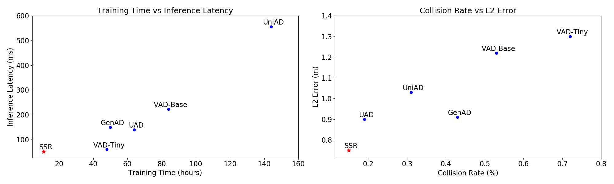
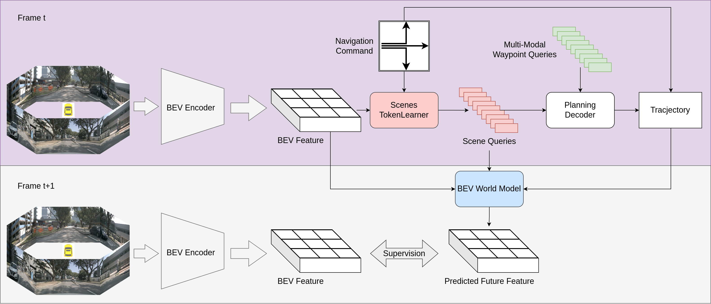
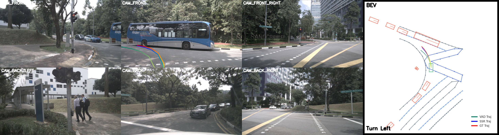

# Navigation-Guided Sparse Scene Representation for End-to-End Autonomous Driving
Original title: **Dose End-to-End Autonomous Driving Really Need Perception Tasks?**

> Peidong Li, Dixiao Cui

> [Zhijia Technology](https://www.smartxtruck.com/), Suzhou, China

## [](https://arxiv.org/abs/2409.18341)

## News

- **2025.03.23** Code and checkpoint released. 🚀
- **2025.02.01** Chinese Blog of SSR available in [zhihu](https://zhuanlan.zhihu.com/p/14173403896).
- **2025.01.23** SSR is accepted to ICLR 2025. 🎉
- **2024.09.30** Paper of SSR available in [arxiv](https://arxiv.org/abs/2409.18341).

## Introduction
We introduce SSR, a novel framework that leverages navigation-guided Sparse Scene
Representation, achieving state-of-the-art performance with minimal costs. Inspired by how human drivers selectively focus on scene elements based on navigation cues, we find that only a minimal set of tokens from dense BEV features is necessary for effective scene representation in autonomous driving. 
<div align="center">
  
</div><br/>

## Overview
SSR consists of two parts: the purple part, which is used during both training and inference, and the gray part, which is only used during training. In the purple part, the dense BEV feature is first compressed by the Scenes TokenLearner into sparse queries, which are then used for planning via cross-attention. In the gray part, the predicted BEV feature is obtained from the BEV world model. The future BEV feature is then used to supervise the predicted BEV feature, enhancing both the scene representation and the planning decoder.
<div align="center">
  
</div><br/>

## Prepare
- [Installation](docs/install.md)
- [Dataset](docs/prepare_dataset.md)

## Train and Test
### Train SSR with 8 GPUs 
```shell
cd /path/to/SSR
conda activate ssr
python -m torch.distributed.run --nproc_per_node=8 --master_port=2333 tools/train.py projects/configs/SSR/SSR_e2e.py --launcher pytorch --deterministic --work-dir path/to/save/outputs
```

### Eval SSR with 1 GPU
```shell
cd /path/to/SSR
conda activate ssr
CUDA_VISIBLE_DEVICES=0 python tools/test.py projects/configs/SSR/SSR_e2e.py /path/to/ckpt.pth --launcher none --eval bbox --tmpdir tmp
```

## Results
*After refactoring, the released checkpoint exhibits minor difference with results reported in the paper.

Log and Checkpoint : [Google Drive](https://drive.google.com/drive/folders/1YFG5JsJ6yuLNl0y1yceV8UxMFyh5138a)
### UniAD-style metric protocal
| Method | L2<sub>MAX</sub> (m) 1s | L2<sub>MAX</sub> (m) 2s | L2<sub>MAX</sub> (m) 3s | L2<sub>MAX</sub> (m) Avg. | CR<sub>MAX</sub> (%) 1s | CR<sub>MAX</sub> (%) 2s | CR<sub>MAX</sub> (%) 3s | CR<sub>MAX</sub> (%) Avg. | 
| --- | --- | --- | --- | --- | --- | --- | --- | --- |
| SSR | 0.25 | 0.64 | 1.33 | 0.74 | 0.00 | 0.08 | 0.43 | 0.17 | 

### VAD-style metric protocal
| Method | L2<sub>AVG</sub> (m) 1s | L2<sub>AVG</sub> (m) 2s | L2<sub>AVG</sub> (m) 3s | L2<sub>AVG</sub> (m) Avg. | CR<sub>AVG</sub> (%) 1s | CR<sub>AVG</sub> (%) 2s | CR<sub>AVG</sub> (%) 3s | CR<sub>AVG</sub> (%) Avg. |
| --- | --- | --- | --- | --- | --- | --- | --- | --- |
| SSR | 0.19 | 0.36 | 0.62 | 0.39 | 0.02 | 0.03 | 0.13 | 0.06 |

## Visualization
We visualize the results of our framework on the nuScenes dataset and Carla Town05 Long benchmark.

### nuScenes
<div align="center">
  
</div><br/>

### Carla
https://github.com/user-attachments/assets/5cf7825c-5c8e-442e-85d3-894f4095f6d6

## Citation
If this work is helpful for your research, please consider citing the following BibTeX entry.

```bibtex
@inproceedings{li2025navigationguidedsparsescenerepresentation,
  title={Navigation-Guided Sparse Scene Representation for End-to-End Autonomous Driving},
  author={Peidong Li and Dixiao Cui},
  booktitle={International Conference on Learning Representations (ICLR)},
  year={2025}
}
```

## License
All code in this repository is under the [Apache License 2.0](https://www.apache.org/licenses/LICENSE-2.0).

## Acknowledgement
SSR is based on the following projects: [VAD](https://github.com/hustvl/VAD), [GenAD](https://github.com/wzzheng/GenAD), [BEV-Planner](https://github.com/NVlabs/BEV-Planner) and [TokenLearner](https://github.com/google-research/scenic/tree/main/scenic/projects/token_learner). Many thanks for their excellent contributions to the community.
